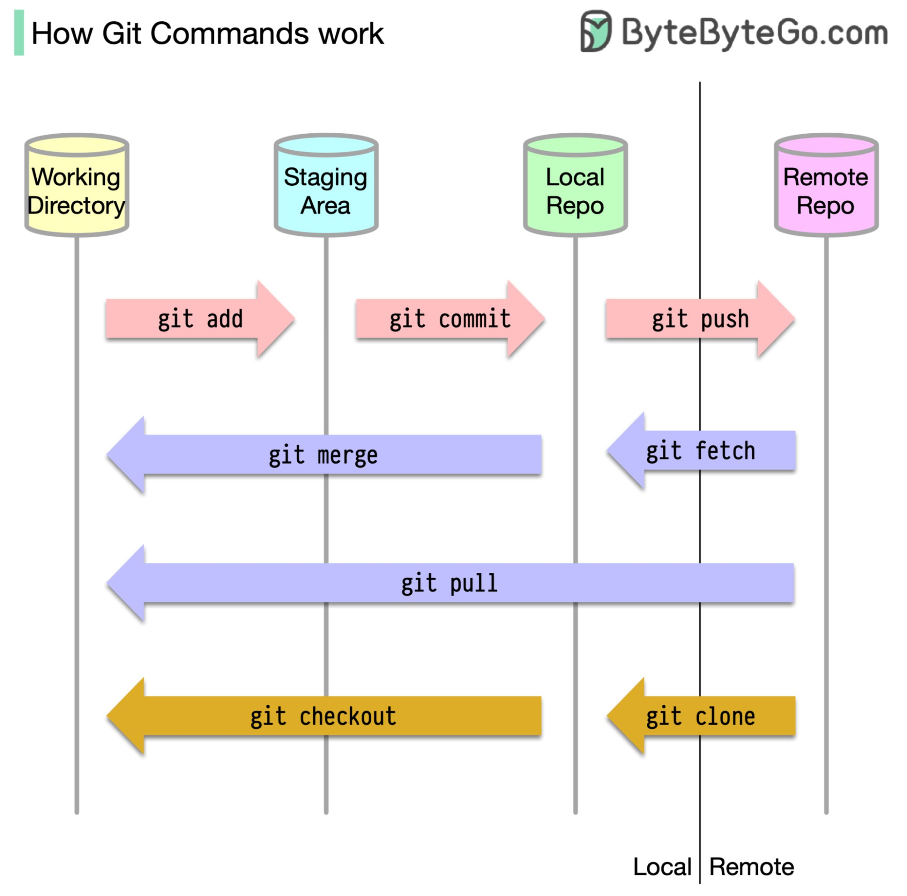

# Setup Git Repo
1) Navigate to the location in your computer where you want the local repository to be stored
2) Open a terminal window at that location
3) In the GitHub repo, click the green Clone button above the file explorer and to the right and copy the HTTPS link
4) In the terminal, type `git clone ` followed by the link you copied
5) You might be asked to login

# Creating a Branch

`git status`: shows info like staged and unstaged changes and status of your repo from the remote
`git add <path>`: adds the contents of the path to the staging area
`git commit -m "Message"`: commits the changes in the staging area to the local repository.  **Always include a message**
`git push`: uploads all of the commits since last merge to the remote repo

`git fetch <branch>`: downloads the new commits from the specified branch (all if omitted) to the local repository but **does not alter your working directory**
`git merge <branch>`: merges the changes between the version in your working directory with the latest from the named branch
`git pull <branch>`: git fetch followed by git merge.  Good for syncing changed since last commit push.

`git checkout <branch>`: loads the selected branch into the working directory

